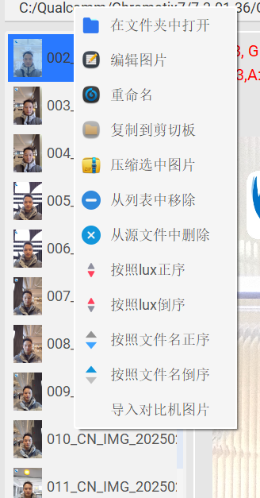
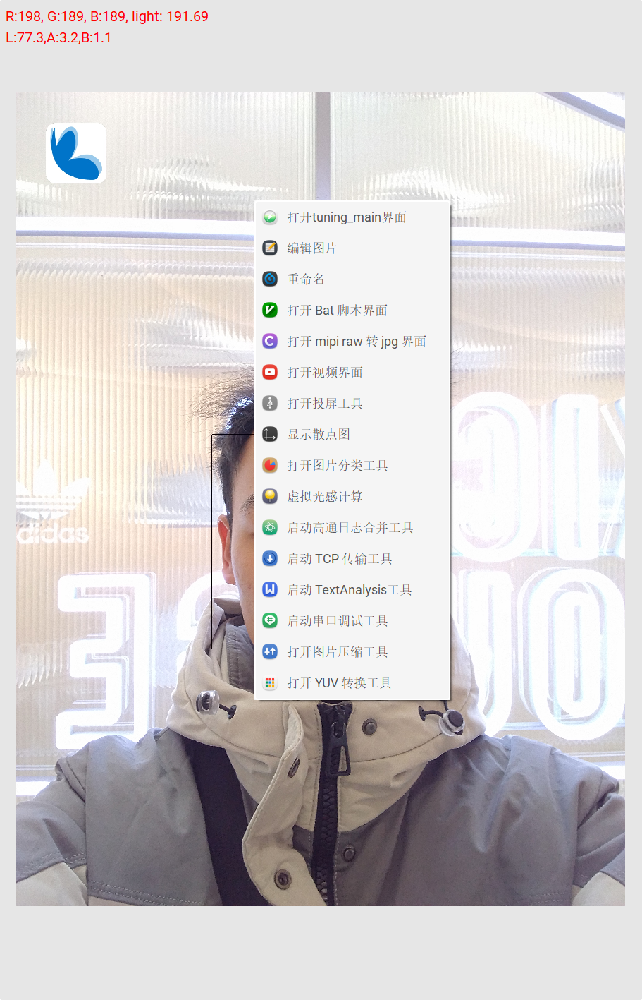
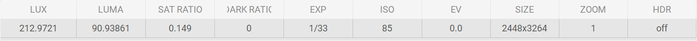
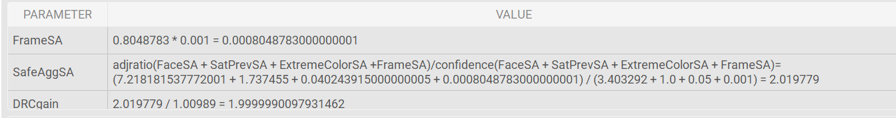
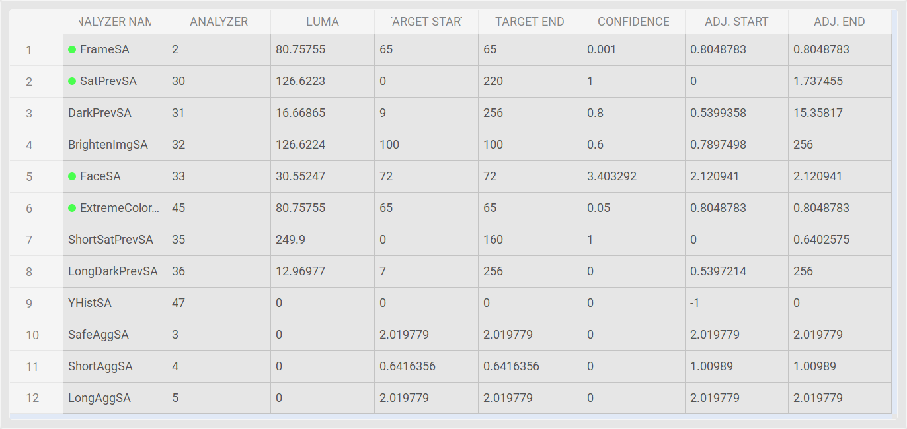
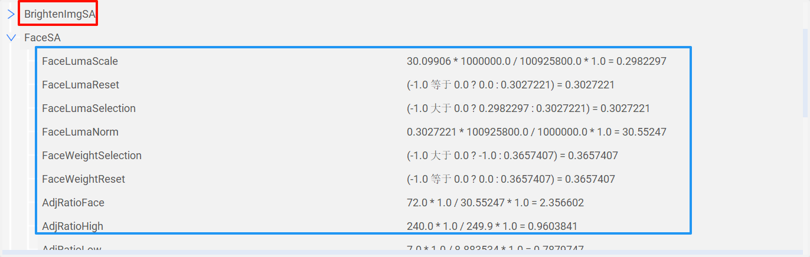

#### 主界面：

#### 界面功能介绍：

###### 1. 界面左侧列表是图片文件列表，用来显示图片文件名和缩略图，缩略图默认不显示请使用快捷键I,触发后稍等片刻即可。

###### 2. 中间是图片显示区域。按住ctrl+鼠标滚轮可以实现鼠标为中心的图片缩放功能。按住shift+鼠标滚轮左右移动图片，单鼠标滚轮可以实现图片上下移动。

###### 3. lux/luma表格显示的是图片的基础信息，包含一些基础的mexif数据。

###### 4. framesa/drc gain表格显示的是frame/safeaggsa和adrc gain的计算过程及其结果。

###### 5. 上图是各个sa相关数据的显示，当sa前面有绿色的圆点，则是此sa参与最终的safe聚合。

###### 6. 上图是step相关数据的显示，step相关数据是根据图片meta解析相关计算步骤，主要展示步骤名和操作的过程，不用再去C7工具反复查找，提高调试效率。

