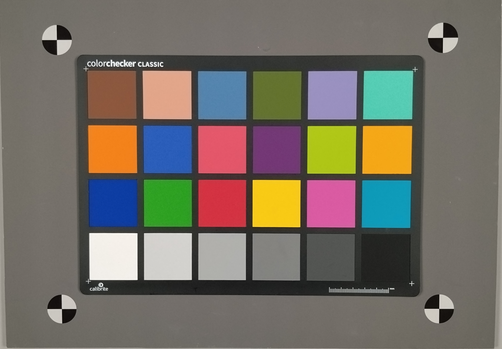

#### 24色卡测试：

#### 使用方法：
###### 1. 请按照A_5_Lux_xxxx.jpg的格式命名图片，否则程序无法正确识别。
###### 2. 点击mcc按钮，将图片文件夹导入程序。
###### 3. 程序不会弹窗，将使用模型自动去检测色卡区域完成数据生成
###### 4. 程序开始生成测试报告，结果保存在程序所在路径下colorchecker_data.xlsx文件中。
