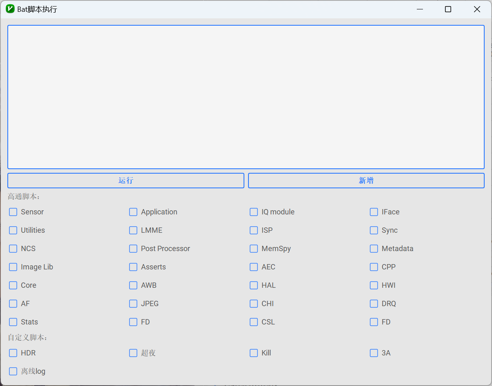
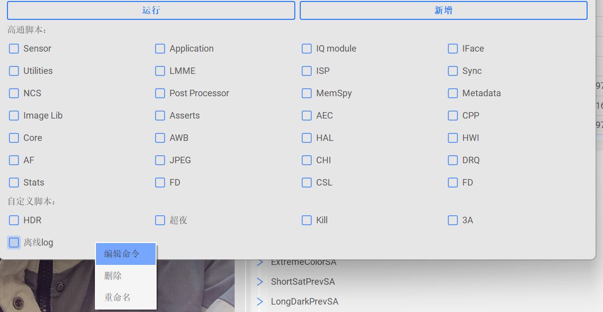
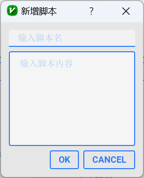

#### bat脚本：

#### 使用方法：
###### 1. 点击bat脚本按钮，进入bat脚本界面。

###### 2. 自定义脚本最后可以右键实现增删改功能

###### 3. 新增：可以实现增加自定义bat脚本，程序会记住用户的自定义脚本内容，程序可以充当bat脚本管理器的功能。
### Tips：
> 脚本是通过本地新建一个tmp.bat文件实现的。没有相关运行的log显示，请连接手机后点击运行，点击后程序开始执行脚本，请耐心等待。请不要重复执行。完成后程序会弹窗显示。