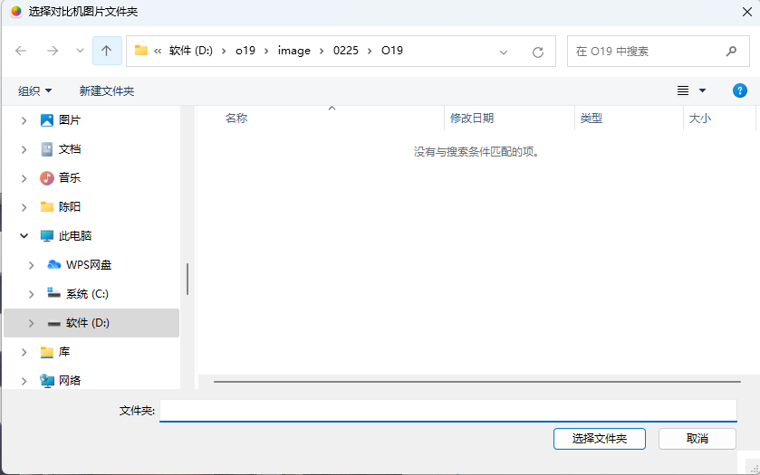
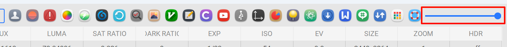
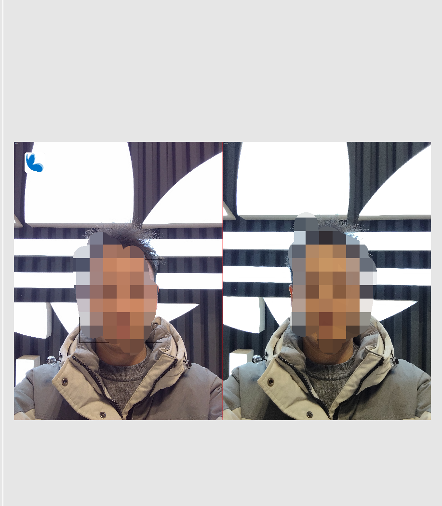

#### 导入对比机图片：

#### 使用方法：
###### 1. 将对比机的图片文件夹导入程序
###### 2. 对比机的图片数量和测试机的必须相同，斗则会乱序。
###### 3. 请不要使用按照lux排序，对比机没办法解析相关数据，导致列表顺序混乱，导致滑动对比时图片错位。
###### 4. 调试界面右上角的滑动条，可以调节覆盖区域，拉到最右侧将同时展示测试机/对比机图片。
