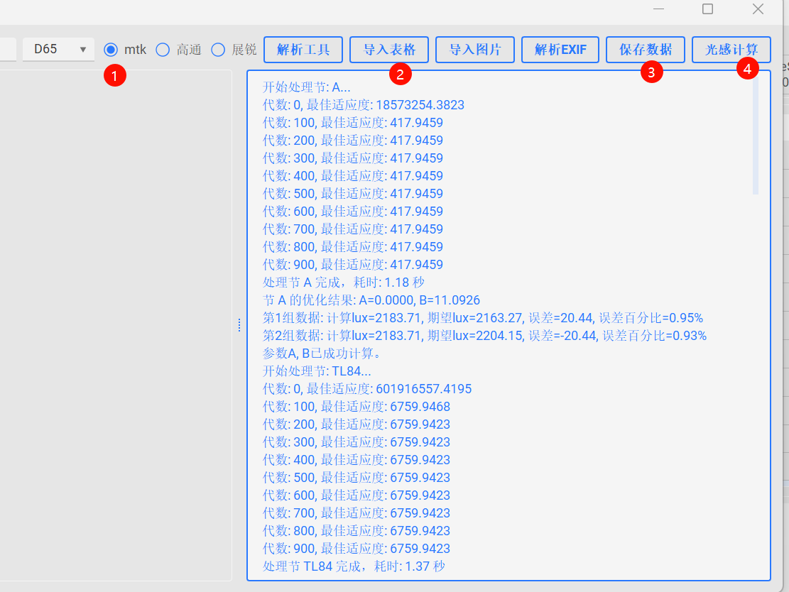

#### 虚拟光感：

#### 使用方法：
###### 1. 点击虚拟光感按钮，进入虚拟光感界面。
###### 2. 选择项目平台信息。
###### 3. 导入表格，高通/mtk(展锐同mtk)是不同的表格，请选择正确的表格。程序所在路径下存在。
###### 4. 将表格中的数据写入config.ini。
###### 5. 点击“虚拟光感“按钮，可以实现虚拟光感标定系数的计算，因为求解过程比较复杂，请耐心等待结果。
### Tips：
> 1. 可以直接将相关数据，lux和bv直接在程序中添加。
> 2. 高通多了一个expectdlux，此数值可以直接从log中抓取。