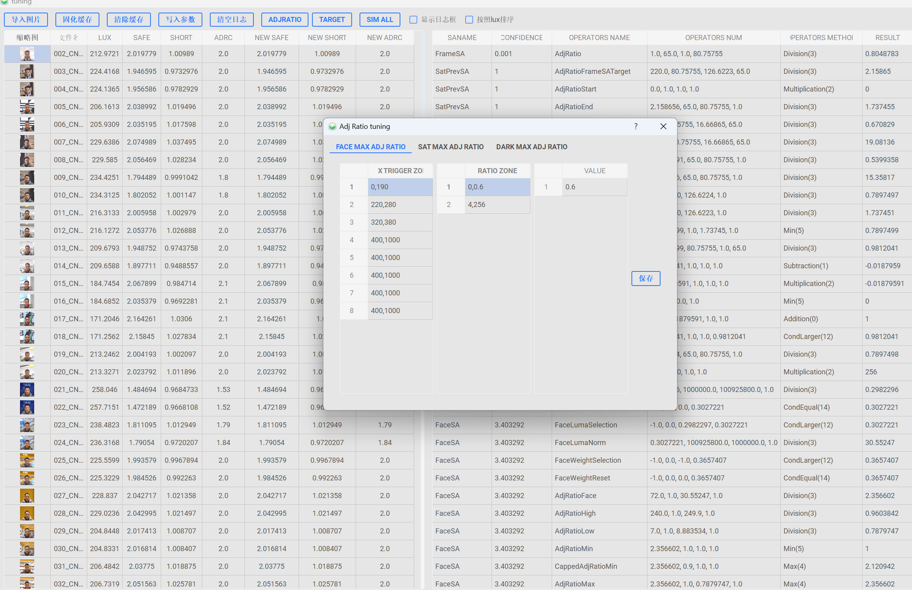
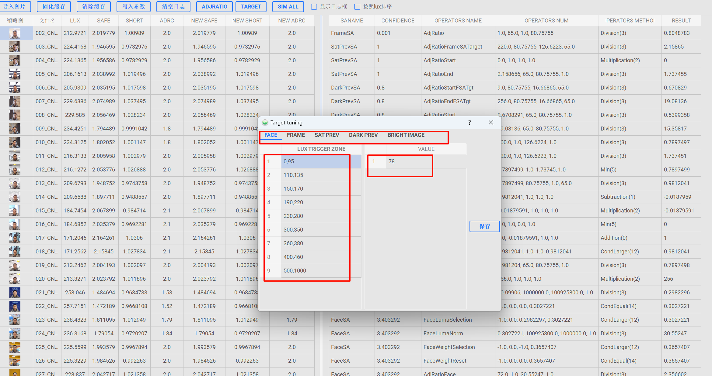
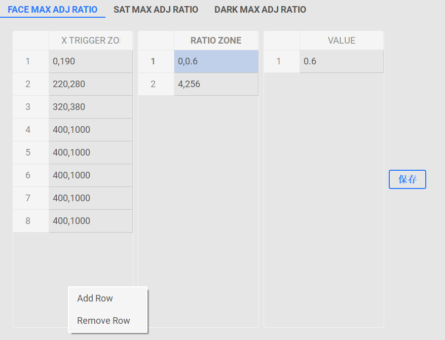
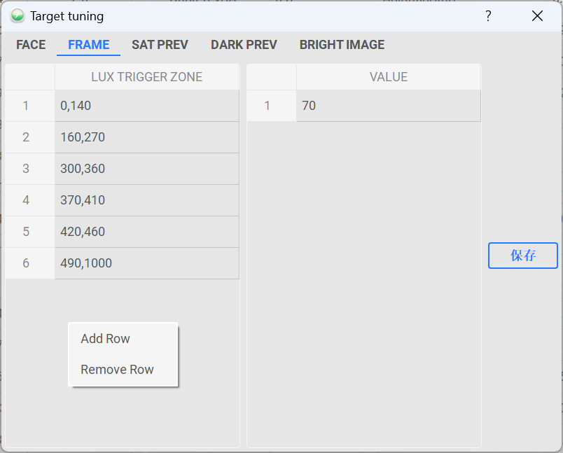
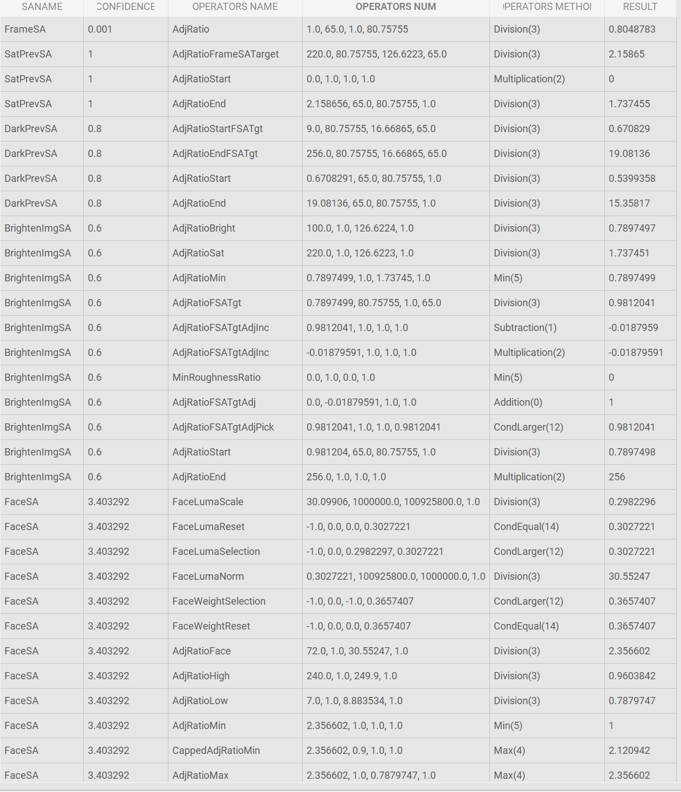

#### Tuning界面：

#### 使用方法：
###### 1. 主界面点击tuning按钮，进入tuning界面。
###### 2. 加载相关图片的数据和缩略图会使得窗口打开稍慢，请耐心等待。
###### 3. 固化缓存：可以将修改的记录保存下来，否则切换到其他图片时，修改的数据会丢失。
###### 4. 写入参数：此功能正在开发中...
###### 5. 清空日志：可以将计算过程中的log清除。
###### 6. ADJRATIO，将展示maxadjratio。

###### 7. 鼠标右键可以增加和删除行。这里面的逻辑和高通c7工具内的一致。
###### 8. 参数会在用户按下enter键的时候自动更新到表格中，完成最终对于adjratio的限制。

###### 9. 现支持face/frame/sat/dark/brightimage sa的target调试，数据将在计算时带入表格中，完成计算。
###### 10.sim_all：将从表格的第一行计算到最后一行，自动完成全部的计算，如果表格中数据较多的情况下，请耐心等待。此功能适合评估参数对于整体的影响。
###### 11.new safe/short/long/adrc：将展示new safe/short/long的计算结果。
###### 12.按照lux排序：可以实现按照luxindex排序(正序)

###### 13.表格中的数据，分别是saname/confidence/操作名/操作数/操作方/结果/
###### 14.表格中代表target的数值修改会被ui界面target的数值覆盖，因此修改不会生效。但是对于luma/confidence/的修改会生效。
### Tips：
>1. 没有做相关异常数据的判断，请默认使用英文输入法，确保没有输入中文符号。仅支持数字输入，切勿输入其他内容。

>2. 对于表格中的数据修改不生效，一方面可能修改的时target会被target按钮中的数值覆盖，另一方面修改的数值是上一步操作的结果，同样会被覆盖，请熟悉ae相关流程，完成ae结果仿真